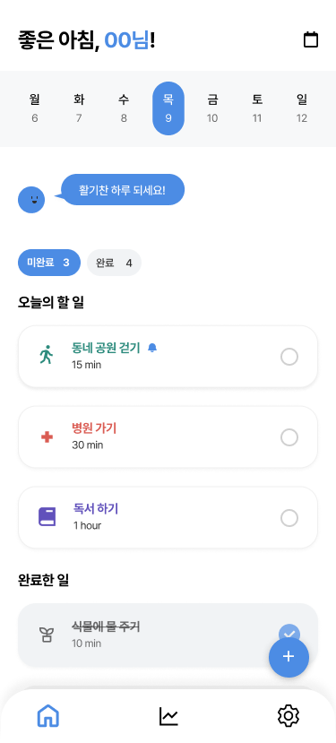
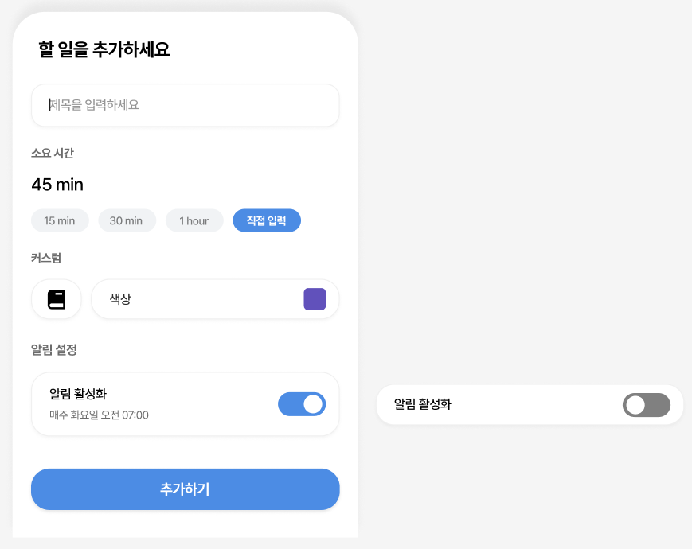
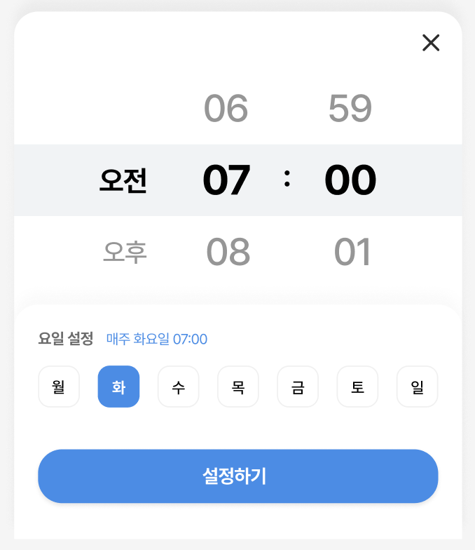
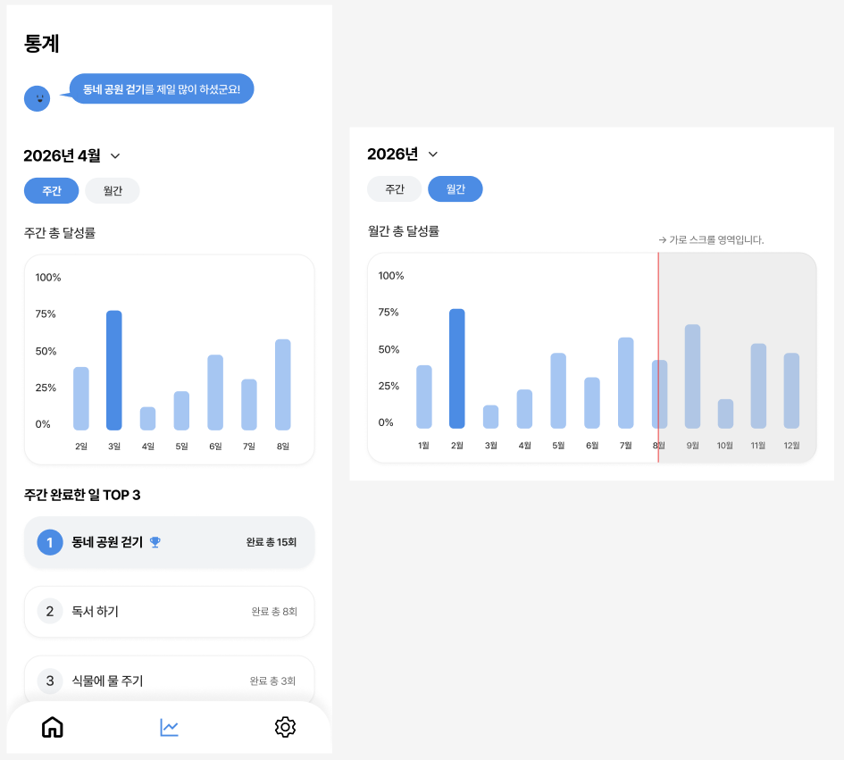
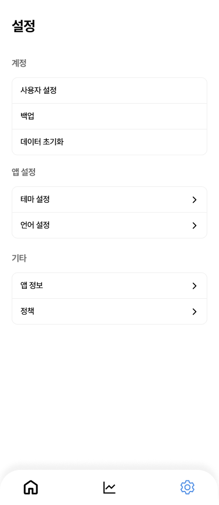
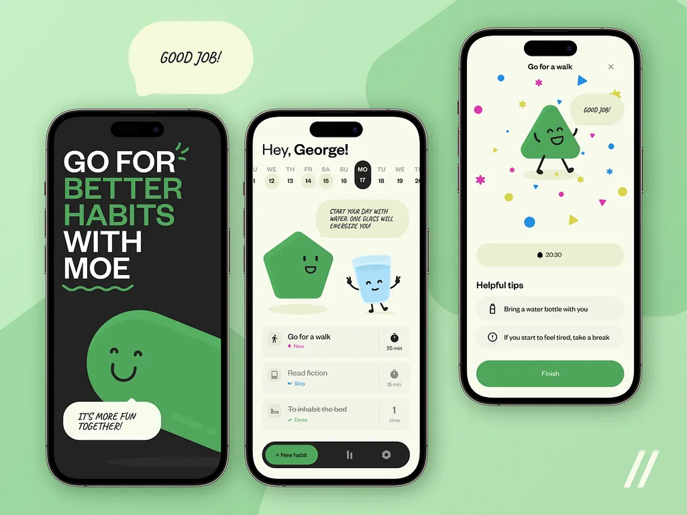

# 프로젝트 이름
캐릭터 요소가 포함된 일상 습관 트래킹 앱 페이지 디자인 및 구현 프로젝트입니다.
(앱 이름 - 미정)

## 기획 의도 
평소 트래킹 어플을 자주 사용해 온 사용자로서 친숙한 분야로 프로젝트를 시작해보자는 목적에서 해당 주제를 채택했습니다.
레퍼런스 조사 중 캐릭터 요소가 가미된 사례들을 참고하였고, 단순한 기록 기능에 더해 캐릭터 요소의 시각적 즐거움이 더해진다면 사용자가 매일 기록하는 과정에서 지루함을 덜 느끼고 지속적으로 서비스를 이용하는 데 도움이 될 것이라 판단했습니다.

## 주요 기능
*해당 사항은 추후 변경 가능성이 있습니다*
- 현재 날짜 표시
- 마스코트(캐릭터) 요소(랜덤 대사 출력)
- 할 일 목록 추가/수정/삭제
- 새로고침 후에도 데이터 유지
- 할 일 완료 체크 및 완료 목록 분리
- 통계 차트 (샘플 데이터)
- 할 일 체크 용 알람(화면 구현 한정)
-> 네비게이션에 별도 항목 메뉴로 존재했으나, 메인 화면의 알람 설정 기능으로 대체 가능하다 판단하여 메뉴를 삭제했습니다.
- 아이콘/색상 커스텀

## 디자인 컨셉
- 파랑 계열 메인 컬러로 활력을 주는 테마
- 할 일 카드 배경은 무채색 유지, 아이콘과 텍스트에만 포인트 컬러 적용
- 사용자 취향에 맞는 아이콘/색상 커스텀 가능

## 사용 기술
- 추후 작성 예정 (세부 조정을 위해 SCSS 고려 중)

## 미리 보기(스크린샷)

본 프로젝트는 하단의 앱 사례들에서 영감을 얻었습니다.
첨부 순서대로 레퍼런스-1, 레퍼런스-2에 해당합니다.

1. 캐릭터 & 애니메이션 관련(레퍼런스-1):
캐릭터를 중심으로 활발한 애니메이션 요소가 포함된 사례를 참고했습니다.  
다만 모든 그래픽을 다이나믹하게 구현하는 것은 현실적 어려움이 있다고 판단하여, 핵심적인 캐릭터 요소와 간단한 애니메이션만을 반영하는 방향으로 기획했습니다.  
현재는 눈 깜빡임, 말풍선 타이핑 효과, 상황 별 대사 변경 등 구체적인 인터랙션을 구상 중입니다.

2. 커스텀 및 UI 관련(레퍼런스-2):
어플 특유의 메인 컬러를 유지하면서도 할 일(habit) 목록을 다양한 색상으로 표현한 사례를 참고했습니다.  
이를 바탕으로 사용자가 각 할 일의 성격에 맞게 색상을 커스텀할 수 있도록 하는 방향을 기획했습니다.  
직관성과 자유도를 높이고 디자인적 즐거움을 더하는 것을 목표로 하고 있습니다.

## 업데이트 내역
**['할 일 추가' -> 알람 설정 페이지] 신규 추가**
- 할 일 추가 페이지에서 알림 활성화 시 나타나는 페이지를 디자인했습니다.
- 오전/오후와 시간대 설정, 매주 반복 요일 지정이 가능합니다.
- 사용자가 시간과 요일을 설정한 경우 '요일 설정' 옆 현재 상태 메시지가 표시됩니다. 

**['설정' 페이지] 신규 추가**
- 사용자 설정 페이지를 디자인했습니다.
- 계정/앱 설정/기타 총 세 개의 범주로 구성됩니다.
- 테마 설정을 통해 사용자가 메인 컬러를 변경할 수 있도록 구현할 예정입니다.

## 개발 기간
- 2026년 4월 ~ 진행 중

## 어려웠던 점 & 해결 과정

## 파일 구조

## 참고 자료
- [참고 레퍼런스-1](https://dribbble.com/shots/21367995-Habit-Tracker-Mobile-IOS-App)
- [참고 레퍼런스-2](https://dribbble.com/shots/24312381-Habit-Tracker-Mobile-iOS-App-Design-Concept)

## 실행 방법

