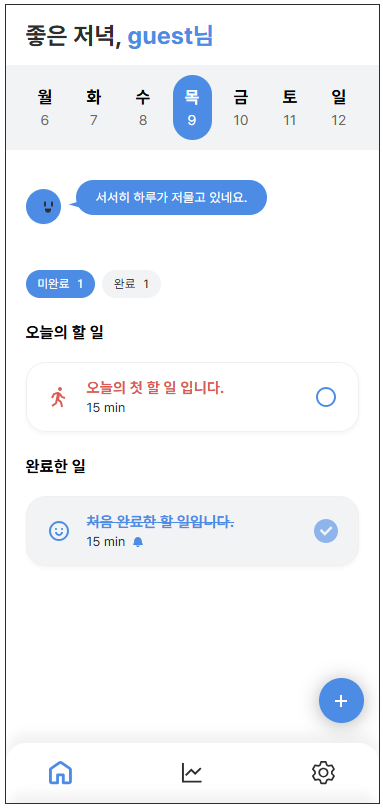
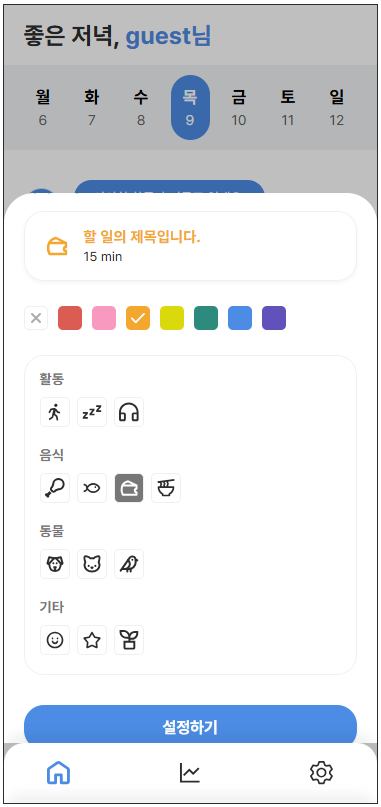
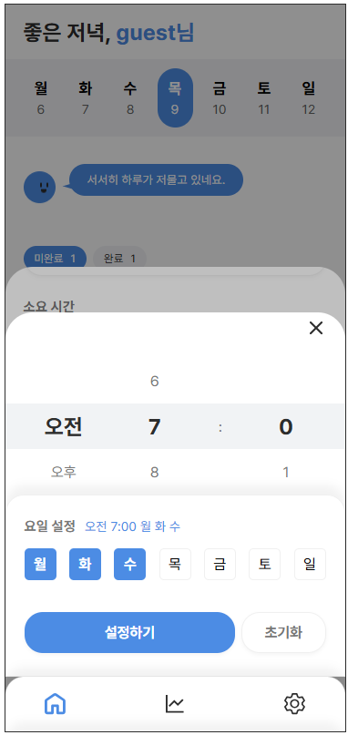
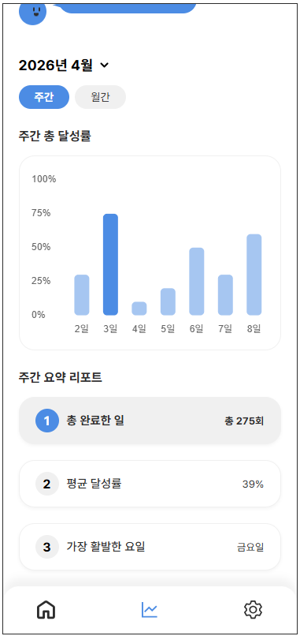
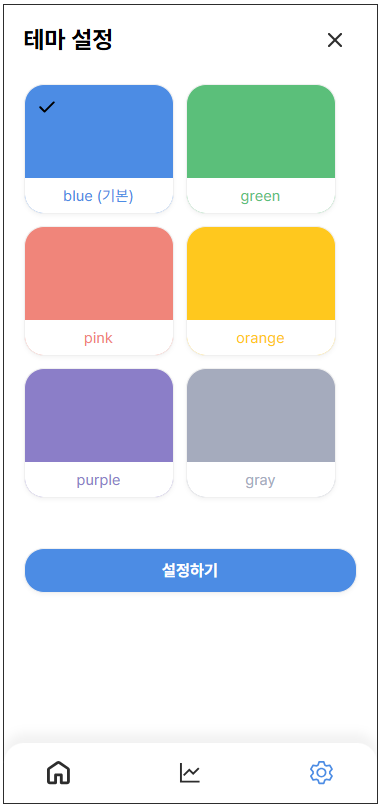
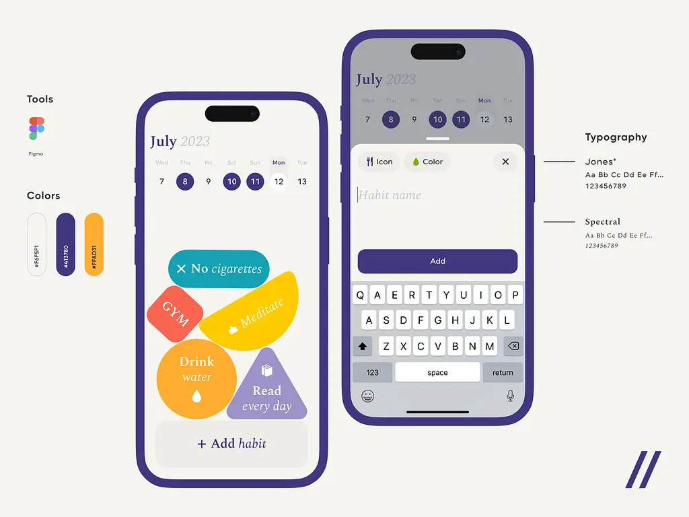

# 프로젝트 이름

캐릭터 요소가 포함된 일상 습관 트래킹 앱 페이지 디자인 및 구현 프로젝트입니다.

> 앱 이름: Todot <br>
> Todo + dot의 합성으로, 둥근 마스코트 Dot과 함께 만드는 하루 습관 어플입니다. 

🔗 배포 주소: https://yona0625.github.io/project-app/

## 기획 의도

평소 트래킹 어플을 자주 사용해 온 사용자로서 친숙한 분야로 프로젝트를 시작해보자는 목적에서 해당 주제를 채택했습니다.
레퍼런스 조사 중 캐릭터 요소가 가미된 사례들을 참고하였고, 단순한 기록 기능에 더해 캐릭터 요소의 시각적 즐거움이 더해진다면 사용자가 매일 기록하는 과정에서 지루함을 덜 느끼고 지속적으로 서비스를 이용하는 데 도움이 될 것이라 판단했습니다.

## 주요 기능

- 현재 날짜 UI 표시
- 마스코트(캐릭터) 요소(랜덤 대사 출력)
- 할 일 목록 추가/수정/삭제
- 새로고침 후에도 데이터 유지
- 할 일 완료 체크 및 완료 목록 분리
- 통계 차트 (샘플 데이터)
- 할 일의 알람 기능
- 아이콘/색상 커스텀

## 기획 변경 사항

- 알람 전용 화면을 별도로 만들지 않고, 메인 화면의 할 일 추가 모달에서 알람을 설정하도록 통합했습니다. (불필요한 화면 분기를 줄이기 위함)
- 카테고리 분류 기능은 범위를 넘어선다고 판단해 제외했습니다. (더미 데이터 규모상 불필요)
- 할 일 통계를 'TOP 3' 형식에서 '리포트' 형식으로 변경했습니다. (제목 입력값의 모호성으로 인한 측정 한계 때문)

## 디자인 컨셉

- 파랑 계열 메인 컬러로 활력을 주는 테마
- 할 일 카드 배경은 무채색 유지, 아이콘과 텍스트에만 포인트 컬러 적용
- 사용자 취향에 맞는 아이콘/색상 커스텀 가능
- 톤 다운된 컬러 커스텀 테마로 차분한 분위기를 연출, 직관적인 UI를 제공

## 사용 기술

- HTML5
- JavaScript (ES6+, Vanilla)
- CSS3 (SCSS): 반복되는 스타일 및 유지 보수 편의성을 위해 사용
- Chart.js: 할 일 통계를 시각적 차트로 표현하기 위해 사용

## 미리 보기(스크린샷)

### [예시 화면] - (메인 화면 / 할 일 커스텀 / 알람 설정 / 통계 / 테마 설정) <br>

<table>
<tr>
    <td valign="top"></td>
    <td valign="top"></td>
    <td valign="top"></td>
  </tr>
  <tr>
    <td valign="top"></td>
    <td valign="top"></td>
  </tr>
</table>

## 참고 레퍼런스

본 프로젝트는 하단의 앱 사례들에서 영감을 얻었습니다.

- **캐릭터 & 애니메이션 관련 (첨부사진 1번)** <br>
  캐릭터를 중심으로 활발한 애니메이션 요소가 포함된 사례를 참고했습니다.  
  다만 모든 그래픽을 다이나믹하게 구현하는 것은 현실적 어려움이 있다고 판단하여, 핵심적인 캐릭터 요소와 간단한 애니메이션만을 반영하는 방향으로 기획했습니다. 눈 깜빡임, 말풍선 타이핑 효과, 상황 별 대사 변경 등 구체적인 인터랙션을 구상했습니다.

- **커스텀 및 UI 관련 (첨부사진 2번)** <br>
어플 특유의 메인 컬러를 유지하면서도 할 일(habit) 목록을 다양한 색상으로 표현한 사례를 참고했습니다.  
이를 바탕으로 사용자가 각 할 일의 성격에 맞게 색상을 커스텀할 수 있도록 하는 방향을 기획했습니다.  
직관성과 자유도를 높이고 디자인적 즐거움을 더하는 것을 목표로 하고 있습니다.
<table>
 <tr>
    <td valign="top"></td>
    <td valign="top"></td>
  </tr>
</table>

- [링크: 참고 레퍼런스-1](https://dribbble.com/shots/21367995-Habit-Tracker-Mobile-IOS-App)
- [링크: 참고 레퍼런스-2](https://dribbble.com/shots/24312381-Habit-Tracker-Mobile-iOS-App-Design-Concept)

## 개발 기간

- 2026년 4월 ~ 2026년 6월

## 어려웠던 점 & 해결 과정

- **수정 모달 기본 아이콘 미반영** <br>
  문제: 수정하기 모달에서 아이콘을 초기화하면 기본 아이콘이 커스텀 영역에서 표시되지 않는 문제 <br>
  해결: 커스텀 공통 설정을 담당하는 setCustom 함수에서 초기화(null)일 때 기본 아이콘(icon-doing.svg)을 표시하도록 분기 처리하여 해결
  <br><br>

- **모달 dimmed 충돌** <br>
  문제: 액션시트에서 수정하기 모달로 전환 시, 액션시트용으로 동적으로 걸어둔 바깥 클릭 핸들러가 지워지지 않고 남아, 수정 모달의 딤드가 풀리는 문제 <br>
  해결: 불필요한 동적 핸들러(container.onclick)를 제거하고, 딤드 클릭으로 모달을 닫는 로직을 한 곳(mainDimmed)으로 통일하여 해결
  <br><br>

- **삭제 취소 시 데이터 깨짐** <br>
  문제: 별도로 걸려있던 저장 타이머가 취소되지 않고 살아남아 복구된 데이터를 다시 덮어쓰고 데이터가 깨지는 문제 <br>
  해결: 저장 로직을 삭제 함수에서 토스트 처리 함수로 옮기고(저장 시점 명확히 분리), 취소 시 타이머를 명시적으로 종료하도록 분리하여 해결

## 파일 구조

```
app/
├── .vscode/
│   └── settings.json/
├── public/
│   ├── icons/
│   └── images/
│       └── docs/
├── src/
│   ├── css/
│   │   ├── common.css
│   │   ├── style.css
│   │   ├── sub1.css
│   │   └── sub2.css
│   ├── js/
│   │   ├── actionSheet.js
│   │   ├── alarm.js
│   │   ├── character.js
│   │   ├── custom.js
│   │   ├── main.js
│   │   ├── modal.js
│   │   ├── render.js
│   │   ├── state.js
│   │   ├── sub.js
│   │   ├── sub2.js
│   │   ├── task.js
│   │   └── toast.js
│   └── scss/
│       ├── common.scss
│       ├── style.scss
│       ├── sub1.scss
│       └── sub2.scss
├── index.html
├── sub1.html
└── sub2.html
```

## 실행 방법

```bash
$ git clone https://github.com/yona0625/project-app.git
```

이후 `index.html` 파일을 브라우저로 열어서 확인 가능합니다.
